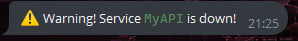
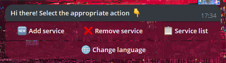

# DownCatcher Telegram Bot

DownCatcher is a bot that automatically pings all your added services and notifies you if one (or all) of them goes down.



You can simply add and delete your services via a convenient menu inside the bot.



The bot supports ``4`` different languages!


> **Warning:** This bot isn't created for multi-user environments. Use it by yourself or within your team.

# Quick start with Docker
___
1. Clone repository
   ```bash
    git clone https://github.com/strix0ff/DownCatcherTGBot.git
    cd DownCatcherTGBot
   ```
2. Clone env
   ```bash
    cp .env.example .env   # Linux
	copy .env.example .env # Windows
   ```
3. Setup ```.env``` file

   ```
   # API

   APIPORT = # Port of FastAPI (Default 8000)
   DBNAME = # Only file name without ".db" (Example: services)
   APIKEY = # Generate any trust API key

   # REDIS

   REDISPORT = # Default 6379 (Recomended 6379)

   # BOT

   BOTTOKEN = # Create any bot here -> @BotFather, and paste its token
   ADMIN_USERID = # Your personal account userid, you can get it here -> @userinfobot
   ```

4. Build and start docker containers
   ```bash
    docker compose up -d --build # Linux
    docker-compose up -d --build # Windows
   ```
5. Send ```/start``` to your bot and enjoy!